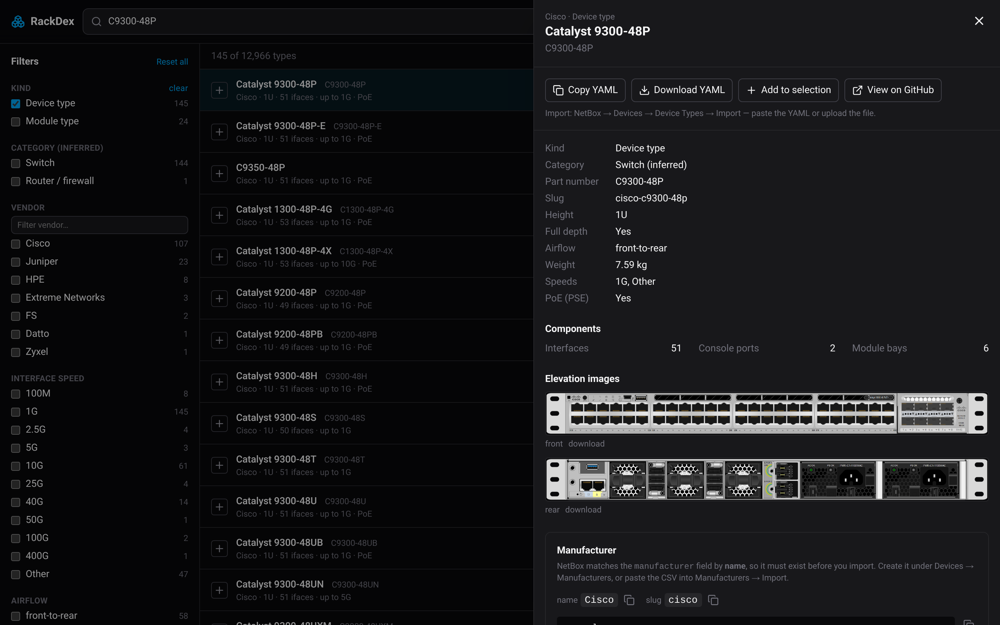
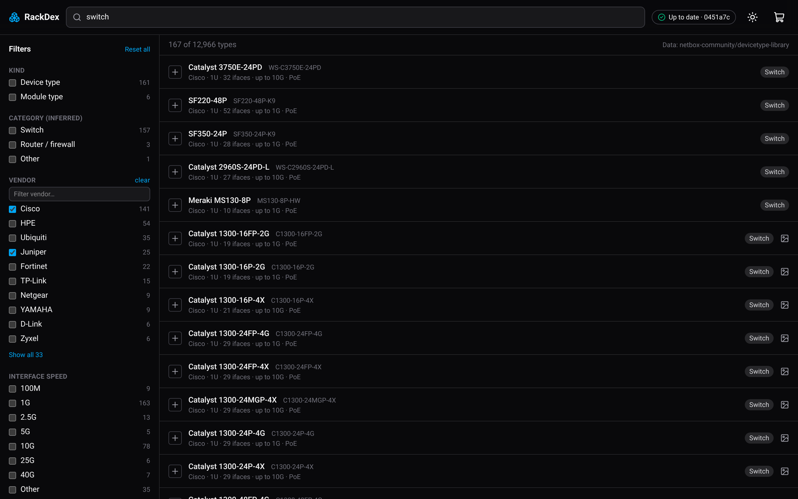

<div align="center">

<h1>
  <picture>
    <source media="(prefers-color-scheme: dark)" srcset="docs/brand/wordmark-dark.png">
    
  </picture>
</h1>

**Gotta rack 'em all.**

Search the entire [NetBox Device Type Library](https://github.com/netbox-community/devicetype-library) in your browser,
then copy import-ready YAML into NetBox in one click.

**[rackdex.acole.dev](https://rackdex.acole.dev)** · [Report an issue](https://github.com/ATCUSA/rackdex/issues)

[](LICENSE)
[](https://github.com/netbox-community/devicetype-library/blob/master/LICENSE.txt)
[](https://svelte.dev)

<br>



</div>

---

RackDex is a free, unofficial search tool for the community-maintained NetBox device type library: **about 13,000
device, module and rack types from nearly 400 vendors**. Instead of browsing thousands of YAML files on GitHub, you type
`c9300 48p`, check the specs and rack images, and press **Copy**.

It runs entirely in your browser: there are no accounts or tracking, and no server beyond static hosting.

## Contents

- [Features](#features)
- [Using RackDex](#using-rackdex)
- [FAQ](#faq)
- [Privacy](#privacy)
- [Self-hosting](#self-hosting)
- [How it works](#how-it-works)
- [Roadmap](#roadmap)
- [Contributing](#contributing)
- [Credits and license](#credits-and-license)

## Features

- **Fuzzy search.** Search model names, part numbers, vendors and slugs. Typos are forgiven, and multi-word queries
  (`juniper ex4300 48`) must match every word.
- **Filters.** Narrow by vendor, kind (device / module / rack), category, rack units, interface count, interface speed
  (100M → 800G), airflow, PoE, console and power ports, device/module bays, and whether a type has elevation images.
  Filter counts update as you go.
- **One-click YAML.** Copy or download the exact upstream definition, ready for NetBox's import page.
- **Bulk export.** Add types to a selection and export them as one multi-document YAML file per kind.
- **Manufacturer helper.** Get the exact manufacturer name and slug, plus a CSV for NetBox's manufacturer import.
- **Rack elevation images.** Front and rear images, with download links.
- **Always current.** Changes made upstream since the last deploy are picked up automatically when you load the page.
- **Shareable links.** Your search, filters and the open type are saved in the URL.
- **Dark mode by default**, with a light theme toggle. It works on mobile too.

<p align="center">
  
</p>

## Using RackDex

### Import one device type into NetBox

1. Search for the model and open it.
2. **Check the manufacturer.** NetBox matches a device type's `manufacturer` by its exact **name**, and the
   manufacturer must already exist. The panel shows the name and slug with copy buttons; create the manufacturer under
   *Devices → Manufacturers* if needed.
3. Click **Copy YAML**, or **Download YAML**.
4. In NetBox, go to *Devices → Device Types → Import*, paste the YAML or upload the file, and submit.

Module types import under *Devices → Module Types → Import*, and rack types under *Racks → Rack Types → Import*. The
panel always shows the right place.

### Import many at once

1. Click **+** on each result you want, or **Add to selection** in the detail panel.
2. Open the selection with the cart icon in the header.
3. For each kind, click **Copy combined** or **Download combined**. You get one YAML file with every type separated by
   `---`, which NetBox's import page accepts in one go.
4. Use the selection's manufacturer CSV to create all the manufacturers first, under *Devices → Manufacturers → Import*.

Your selection is saved in your browser, so it's still there when you come back.

### Tips

- Press <kbd>/</kbd> to jump to the search box, and <kbd>Esc</kbd> to close a panel.
- Copy the address bar to share exactly what you're looking at.
- Filters combine: values within one filter are OR'd (Cisco *or* Juniper), and different filters are AND'd
  (Cisco *and* 1U *and* PoE).

## FAQ

**NetBox says the manufacturer doesn't exist.**
Create it first, using the exact name from the manufacturer helper. `Hewlett Packard Enterprise` and `HPE` are
different manufacturers to NetBox.

**Why does it say a category is "inferred"?**
The library doesn't record categories. RackDex guesses one from each type's components: for example, power outlets
make it a PDU, and only front/rear ports make it a patch panel. That's useful for browsing, but not authoritative. Many
0U devices (access points, phones, small appliances) end up under *Other*.

**What does the PoE filter mean?**
Devices that *supply* PoE (PSE), such as PoE switches and injectors. Devices that only draw PoE, like access points and
phones, don't count.

**The header badge says "Data from …". Is something broken?**
No. RackDex checks GitHub once per visit for upstream changes. If GitHub is rate-limiting you (60 requests an hour
without an account) or can't be reached, RackDex uses the data from its last deploy and says so. Search and export
still work. The badge usually shows **Up to date** or **Live · N updates**.

**A device is missing or has wrong data.**
RackDex only displays the library. Please fix it upstream: see the library's
[contributing guide](https://github.com/netbox-community/devicetype-library/blob/master/CONTRIBUTING.md). Your change
shows up in RackDex automatically once it's merged.

**Can RackDex push types straight into my NetBox?**
Not yet, but it's first on the [roadmap](#roadmap). NetBox's API needs each component created separately, so it's
more involved than pasting YAML.

## Privacy

- No accounts, no cookies, no analytics, no ads.
- Your browser talks only to the site itself, `api.github.com` (one change check per visit, cached for 15 minutes)
  and `raw.githubusercontent.com` (YAML files and images).
- Your selection, theme choice and the update cache are kept in your browser's local storage and are never sent
  anywhere.

## Self-hosting

RackDex is a static site, so it runs on any static host. The build downloads the library's YAML (about 60 MB, cached
in `.cache/`) and writes a ~6 MB search index. The rack images are never downloaded.

**Requirements:** Node 22+ and [pnpm](https://pnpm.io) 11.

```bash
git clone https://github.com/ATCUSA/rackdex.git && cd rackdex
pnpm install
pnpm dev          # builds the index on first run → http://localhost:5173
```

```bash
pnpm build        # refresh the index + build the site into build/
pnpm preview      # serve that build locally
```

To index a specific branch or commit of the library, set `DTL_REF`, for example `DTL_REF=<branch-or-sha> pnpm index`.

### Cloudflare Workers (recommended)

RackDex deploys as a static-assets-only Worker; the config is already in [`wrangler.jsonc`](wrangler.jsonc).

1. In the Cloudflare dashboard, go to **Workers & Pages → Create → Import a repository** and pick your fork.
2. Use these build settings:

   | Setting | Value |
   |---|---|
   | Build command | `pnpm build` |
   | Deploy command | `npx wrangler deploy` |
   | Build variables | `NODE_VERSION=22`, `PNPM_VERSION=11.17.0` |

3. Optionally, add a custom domain under the Worker's **Settings → Domains & Routes**.

Every push to `main` deploys, and pull requests get preview URLs. The site is about 20 files, well within the limits,
and requests for static assets are free. Visitors get upstream changes live, so rebuilds only refresh the baseline,
which makes the first load a little faster.

The [Refresh data](.github/workflows/refresh-data.yml) workflow does this once a day: if the library has new commits
since the last deploy, it rebuilds, runs the tests and deploys with wrangler. It needs two repository secrets:

- `CLOUDFLARE_API_TOKEN`: an API token made from the **Edit Cloudflare Workers** template.
- `CLOUDFLARE_ACCOUNT_ID`: your account ID, shown on the Workers & Pages overview page.

You can also run it by hand from the Actions tab, with an option to deploy even if nothing changed. It checks the
deployed site at `rackdex.acole.dev`, so change that URL in the workflow if you deploy elsewhere.

To deploy from your own machine instead, run `pnpm build && npx wrangler deploy` (wrangler asks you to log in the
first time).

Cloudflare Pages, Netlify, GitHub Pages, nginx or any other static host work too: serve the `build/` directory and use
`build/404.html` as the not-found page.

## How it works

```
 build time                                  in your browser
┌───────────────────────────────┐ index.json ┌──────────────────────────────────┐
│ sparse-clone YAML only (60 MB)│ ─────────▶ │ Web Worker: Fuse.js + filters    │
│ parse 13k types → 6 MB index  │            │ 1 GitHub compare call → live Δ   │
│ skips 900 MB of images        │            │ YAML + images fetched from GitHub│
└───────────────────────────────┘            └──────────────────────────────────┘
```

1. **Index.** `scripts/build-index.ts` does a blob-less sparse clone of the library's `device-types/`,
   `module-types/` and `rack-types/` folders, parses every YAML file into a compact record (specs, component counts,
   interface speeds, image paths), and writes `static/data/index.json` along with the commit it came from.
2. **Search.** The browser loads the index and hands it to a Web Worker running [Fuse.js](https://fusejs.io), so
   typing stays smooth across all 13k records.
3. **Stay current.** On load, RackDex asks GitHub's compare API what changed on `master` since the indexed commit,
   fetches only those files and merges them in. If that fails, it silently falls back to the indexed data.
4. **Export.** YAML and images are always fetched straight from GitHub at the matching commit, so what you copy is
   exactly what's upstream.

**Stack:** SvelteKit (static adapter) · Svelte 5 · TypeScript · Tailwind CSS v4 · Lucide icons · Fuse.js ·
Vitest · Playwright

## Roadmap

Ideas for future versions, roughly in priority order. Nothing here is promised; open an issue if one matters to you.

- **Send to NetBox.** Push your selection straight into a NetBox instance over its API instead of copying YAML:
  create any missing manufacturers, then the device/module/rack types, then all their components (interfaces,
  console and power ports, front/rear ports, bays). It would use your own NetBox API token, which stays in your
  browser, and needs CORS enabled on your NetBox, or a small optional helper if you can't change that.
- **Already-in-NetBox check.** Connect read-only to your NetBox and mark which types you already have, so you only
  import what's missing.
- **What's new upstream.** A view of types recently added or changed in the library.
- **Port media filters.** Filter by connector as well as speed (RJ45, SFP+, SFP28, QSFP28, fiber vs copper) and by
  port counts per media type.
- **Side-by-side compare.** Compare two or three types: ports, power, height, weight and airflow.

## Contributing

Issues and pull requests are welcome. See **[CONTRIBUTING.md](CONTRIBUTING.md)** for the ground rules, setup, checks
and PR workflow. For problems with **device data**, go to the
[devicetype-library](https://github.com/netbox-community/devicetype-library) instead; RackDex just displays it.
Security issues: see [SECURITY.md](SECURITY.md). Release history: [CHANGELOG.md](CHANGELOG.md).

```bash
pnpm install
pnpm dev          # dev server with hot reload
pnpm test         # unit tests (Vitest)
pnpm check        # type check (svelte-check)
pnpm test:e2e     # browser tests (Playwright; run `pnpm index` once first)
```

Before opening a PR, please make sure `pnpm test`, `pnpm check` and `pnpm test:e2e` all pass.

```
scripts/            build-time indexer (clone, parse, write index.json)
src/lib/            parsing, search, filters, live updates, YAML export, stores
src/lib/components/ UI components (search, filters, results, detail panel, selection)
src/routes/         pages: search (/) and about (/about)
e2e/                Playwright tests
docs/               screenshots and brand assets (logo, wordmarks, social image)
```

## Credits and license

**Every device, module and rack definition in RackDex is the work of the maintainers and
[contributors](https://github.com/netbox-community/devicetype-library/graphs/contributors) of the
[netbox-community/devicetype-library](https://github.com/netbox-community/devicetype-library).** Thank you! The
library is released under [CC0-1.0](https://github.com/netbox-community/devicetype-library/blob/master/LICENSE.txt).

RackDex's own code is released under the [MIT License](LICENSE).

RackDex is an independent community project. It is not affiliated with or endorsed by NetBox Labs, and NetBox is a
trademark of NetBox Labs.
